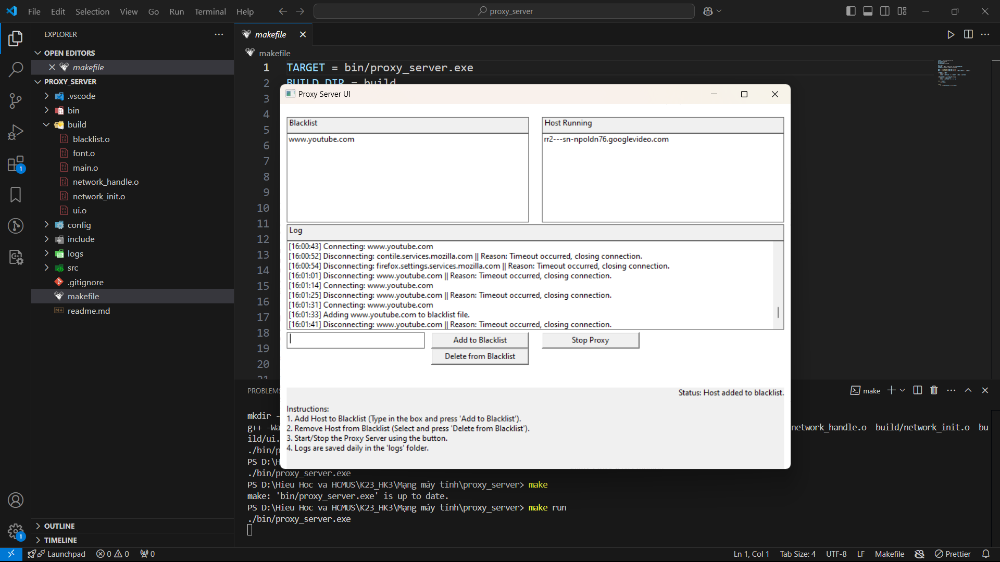

## Đồ án lập trình proxy server https bằng ngôn ngữ C++
Lớp: 23CNTN - https://www.fit.hcmus.edu.vn/vn/

Môn: Mạng máy tính (Học kỳ 1 | 2024 - 2025)

## Trình duyệt dùng để kiểm thử
Để khởi tạo proxy server, các kết nối kiểm thử được thực hiện bằng trình duyệt Firefox với sự hỗ trợ của việc chỉ chạy proxy server độc lập thay vì phải cài cho cả hệ thống.
 

## Tiến độ:
+ Có UI, lưu trữ các tệp logs để kiểm lỗi.
+ Tích hợp thêm vào blacklist, xóa khỏi blacklist trong lúc thực thi ngay trên UI.
+ Quản lý được các url, host, ... đang hoạt động một cách trực quan.

+ Mở được đơn tab / website.

+ Mở được song song nhiều tab / website.

+ Chặn các trang không mong muốn người dùng truy cập.

## Một số chú ý về các files đính kèm:
`.gitignore`: Chặn các folders - files không muốn đẩy lên github.

`makefile`: Dịch toàn bộ dự án proxy server.
+ Cài make bằng msys2.

`readme.md`: Tạo trang preview trên github.
