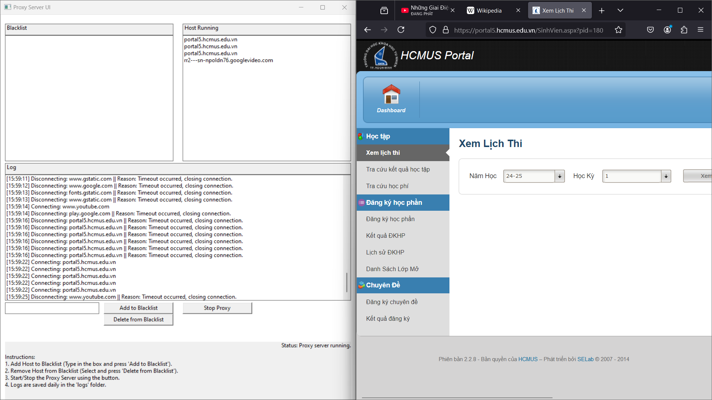

# Đồ án lập trình proxy server cho https bằng ngôn ngữ C++
Lớp: 23CNTN - fit.hcmus
Môn: Mạng máy tính (Học kỳ 1 | 2024 - 2025)

## Trình duyệt dùng để kiểm thử
Để khởi tạo proxy server, các kết nối kiểm thử được thực hiện bằng trình duyệt Firefox với sự hỗ trợ của việc chỉ chạy proxy server độc lập thay vì phải cài cho cả hệ thống.
 

## Tiến độ:
### Đã làm được
+ Đã mở được nhiều tab / website

+ Đã chặn được những website cần chặn (config\blacklist.txt)

### Chưa làm được:
+ Các Active Threads của những tabs đã tắt vẫn mất rất nhiều thời gian để kết thúc (ước tính tầm 30s cũng tạm chấp nhận được).
+ Chưa lưu được dữ liệu về trên máy chủ để cấp phát cho máy con.
+ ...

## Một số chú ý về các files đính kèm:
`.gitignore`: Chặn các folders - files không muốn đẩy lên github.
`makefile`: Dịch toàn bộ dự án proxy server.
    - make    : dịch code 
    - make run: dịch code và chạy
    - Khuyến khích dùng 'start make run' để xem được rõ ràng hơn.
    - Cài make bằng msys2 (update sau) 
`readme.md`: Tạo trang preview trên github.